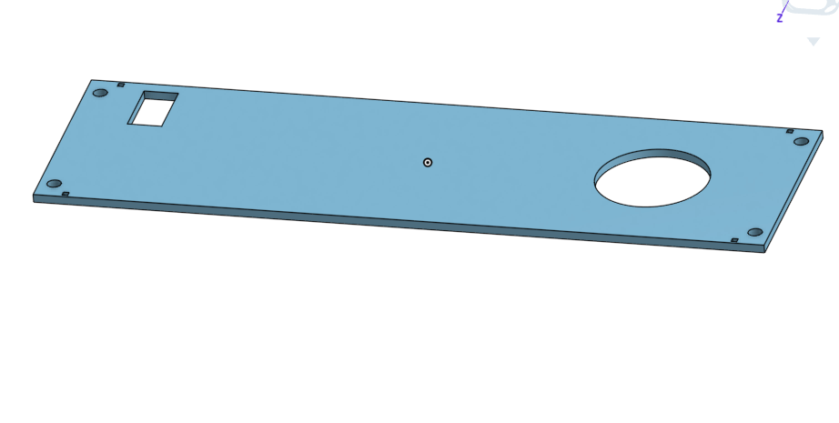

# Arduino-Mount

## Planning

### Idea
Our idea is to create a little ramp and use our servo to hit a ball up that ramp. There will be a small hole at the top that the ball can go in. 

### Schedule
Ramp and base: done

Legs to hold it up: done

Rails: done

Button pannel: done

Ball return path: done

Servo module with paddle: done

Arduino and Servo brackets:

Arduino wiring plan:

Final assembly:

Building it in real life:

### Plan Images

---
## Design

### Description

### Images

#### Base

#### Ramp

#### 40mm Post

#### 130mm Post

#### Button pannel

#### Rail 1

#### Rail 2

#### Basket

#### Arm

---
### Evidence

[Ramp](https://cvilleschools.onshape.com/documents/57f349c920b3da7be96b1ff0/w/b5f5c9a8493b548af2075f45/e/e82e654f3b537c960b82a00c)

[Base](https://cvilleschools.onshape.com/documents/57f349c920b3da7be96b1ff0/w/b5f5c9a8493b548af2075f45/e/290327dddf47814f99deb229)

[40mm Post](https://cvilleschools.onshape.com/documents/57f349c920b3da7be96b1ff0/w/b5f5c9a8493b548af2075f45/e/9c7c9f9765d6bc0b6d70a6f8)
 
[130mm post](https://cvilleschools.onshape.com/documents/57f349c920b3da7be96b1ff0/w/b5f5c9a8493b548af2075f45/e/91146e8eed039daa7fb1ab62)

[Button pannel](https://cvilleschools.onshape.com/documents/57f349c920b3da7be96b1ff0/w/b5f5c9a8493b548af2075f45/e/7664e38096a3584d1f02fb47)

[Rail 1](https://cvilleschools.onshape.com/documents/57f349c920b3da7be96b1ff0/w/b5f5c9a8493b548af2075f45/e/18abd3f7ff5980902a7ad3ba)

[Rail 2](https://cvilleschools.onshape.com/documents/57f349c920b3da7be96b1ff0/w/b5f5c9a8493b548af2075f45/e/91146e8eed039daa7fb1ab62)

[Assembly](https://cvilleschools.onshape.com/documents/57f349c920b3da7be96b1ff0/w/b5f5c9a8493b548af2075f45/e/a862f202f23f913e201b4262)

[Basket](https://cvilleschools.onshape.com/documents/57f349c920b3da7be96b1ff0/w/b5f5c9a8493b548af2075f45/e/afc6de6bad3ef510bf1a43e8)

[Arm](https://cvilleschools.onshape.com/documents/57f349c920b3da7be96b1ff0/w/b5f5c9a8493b548af2075f45/e/57320502d59f291ab3e57d0e)

---
### Code

/*
  Evie Brantley and Zachary Siller
  3/3/21
  When you push a button, this code spins a servo forwards (left) and has it reset to its original position
*/
#include <Servo.h>

Servo myServo;
int BtnPin = 8;
int servoPin = 2;
int BtnState = 0;
int ServoRest = 0;
int ServoShoot = 90;
void setup() {
  Serial.begin(9600);
  myServo.attach(servoPin);//Attaches the servo object to a pin
  pinMode(BtnPin, INPUT);
  pinMode(servoPin, OUTPUT);
  Serial.println("begin");
  myServo.write(ServoRest);//puts rest position at 0 degrees
}
void loop() {
  BtnState = digitalRead(BtnPin);
  Serial.print("Btnstate = ");
  Serial.println(BtnState);
  if (BtnState == HIGH) {
    Serial.println("Button On");
    myServo.write(ServoShoot);//assuming we are using standard servo. (if cont. rotation,70-89)
    delay(500);
    myServo.write(ServoRest);//I think this returns it to the original position?
  }
  else {
    Serial.println("Off");
  }
}

## Construction

## Final Thoughts
